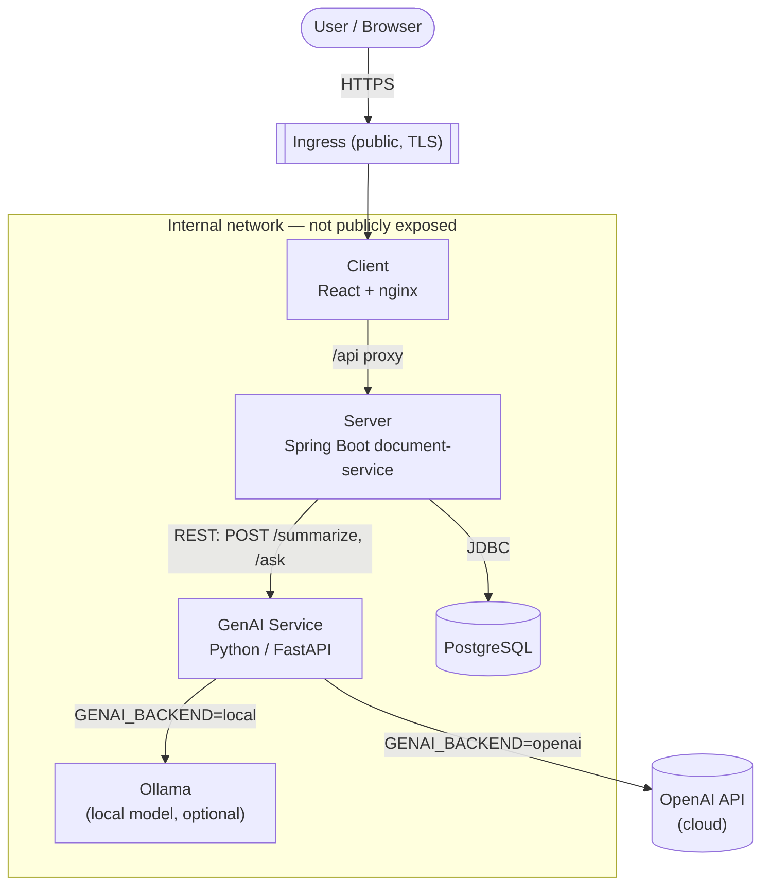
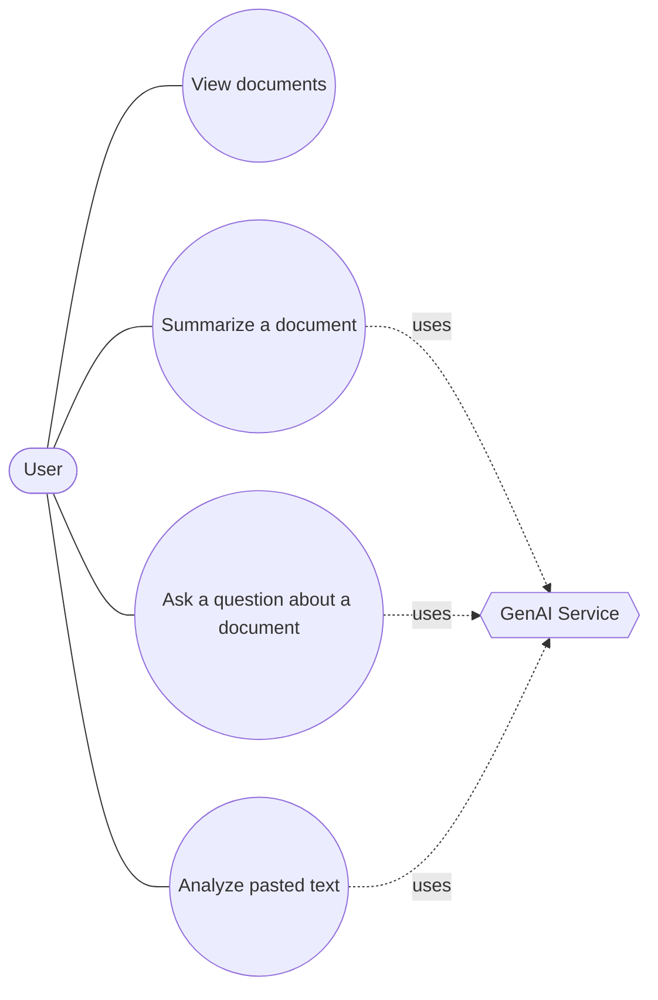
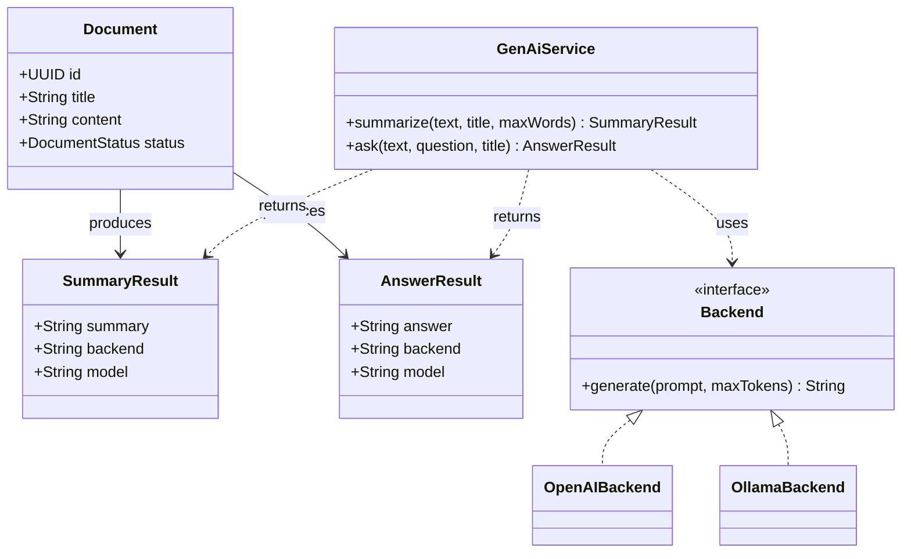

# SmartDoc — AI-Powered Document Management

SmartDoc is a microservices-based application for document management and analysis powered by Artificial Intelligence. Users browse documents and use the **GenAI service** to **summarize** them or **ask questions** about their content, with inference served by either a **cloud model (OpenAI)** or a **self-hosted local model (Ollama)** — selectable through configuration.

This repository contains the full source code, infrastructure as code, and configuration management required to run SmartDoc locally, on Microsoft Azure, and on the AET Kubernetes cluster.

---

## Repository Structure
```
.
├── client/                              # React-based frontend application
├── server/
│   └── services/
│       └── document-service/            # Spring Boot microservice (REST API) — calls the GenAI service
├── genai/                               # GenAI microservice (independent Python / FastAPI)
│   ├── Dockerfile
│   ├── requirements.txt
│   └── app/                             # main.py (routes), config.py, schemas.py, prompts.py, backends/
├── infra/
│   ├── terraform/                       # Azure infrastructure as code
│   └── ansible/                         # VM configuration and deployment playbooks
├── helm/
│   └── smartdoc/                        # Helm chart for the AET Kubernetes cluster
│       ├── Chart.yaml
│       ├── values.yaml                  # All environment-specific values (incl. genai.*)
│       └── templates/                   # Deployments, Services, ConfigMaps, Secrets, Ingress
│           ├── genai-deployment.yaml    # GenAI Deployment
│           ├── genai-service.yaml       # GenAI Service (ClusterIP — internal only)
│           ├── configmap-genai.yaml     # GenAI non-secret config (backend, model)
│           └── secret-genai.yaml        # GenAI cloud API key (chart-managed, optional)
├── docker-compose.yml                   # Local and remote container orchestration (incl. genai)
└── .github/
    └── workflows/                       # CI/CD pipelines
```

---

## Generative AI Feature (GenAI Service)

SmartDoc's Generative-AI capability is implemented as an **independent Python
(FastAPI) microservice** in [`genai/`](genai). It is an **internal** component —
like the database, it is reached only by the server and is **never exposed to
the public internet** through the Ingress.

### What it does, and how a user reaches it

From the client (the only public entry point) a user can:

- **Summarize** any document — click **Summarize** on a document card.
- **Ask a question** about a document — type a question on the card and click **Ask**.
- **Analyze their own text** — paste arbitrary text in the *"Analyze your own text"*
  panel and summarize it or ask a question about it.

Every result shown is **real model output produced at request time** (never a
hardcoded or precomputed value). A small "via `backend` · `model`" label under
each result shows which inference backend produced it.

The end-to-end path is strictly **client → server → GenAI service → client**;
the client never calls the GenAI service directly:

```
User clicks "Summarize"
  → Client  POST /api/v1/documents/{id}/summarize   (through the nginx /api proxy)
  → Server  POST http://genai:8000/summarize        (internal REST call)
  → GenAI   calls the configured model (OpenAI cloud or local Ollama)
  → Summary rendered back in the client
```

### Component diagram



Only the **client** is reachable from the internet. The **server**, **database**
and **GenAI service** are internal ClusterIP/compose-internal services.

### Use case diagram



### Analysis object model



### REST interface (the defined contract)

The server calls these endpoints on the GenAI service (internal):

| Method & path | Request | Response |
|---------------|---------|----------|
| `GET  /health`    | – | `{ status, backend, model }` |
| `POST /summarize` | `{ text, title?, max_words? }` | `{ summary, backend, model }` |
| `POST /ask`       | `{ text, question, title? }` | `{ answer, backend, model }` |

The server exposes the matching application endpoints to the client:
`POST /api/v1/documents/{id}/summarize`, `POST /api/v1/documents/{id}/ask`,
`POST /api/v1/genai/summarize`, `POST /api/v1/genai/ask`, and
`GET /api/v1/genai/health`.

### Cloud vs. local inference (selectable through configuration)

The active backend is chosen with the **`GENAI_BACKEND`** variable — no code
change, no rebuild, and no key ever baked into the image:

| `GENAI_BACKEND` | Backend | What the operator must provide |
|-----------------|---------|--------------------------------|
| `openai` (default) | Cloud — OpenAI / OpenAI-compatible API | `OPENAI_API_KEY` (secret) + `GENAI_MODEL` (e.g. `gpt-4o-mini`) |
| `local` | Local / self-hosted — [Ollama](https://ollama.com) | A reachable Ollama server (`OLLAMA_BASE_URL`) + `GENAI_LOCAL_MODEL` (e.g. `llama3.2:1b`). No API key, data stays on-prem. |

GenAI environment variables (see [`.env.example`](.env.example) and
[`genai/README.md`](genai/README.md) for the full list):

| Variable | Default | Description |
|----------|---------|-------------|
| `GENAI_BACKEND` | `openai` | `openai` (cloud) or `local` (Ollama) |
| `OPENAI_API_KEY` | – | **Secret.** Required for the cloud backend; never committed |
| `GENAI_MODEL` | `gpt-4o-mini` | Cloud model name |
| `OPENAI_BASE_URL` | – | Optional OpenAI-compatible endpoint override |
| `OLLAMA_BASE_URL` | `http://ollama:11434` | Ollama server URL (local backend) |
| `GENAI_LOCAL_MODEL` | `llama3.2:1b` | Local model name |
| `GENAI_BASE_URL` | `http://genai:8000` | **Set on the server**, not on GenAI — how the server reaches the GenAI service |

### How the server reaches the GenAI service internally

The server never hardcodes the GenAI address. It reads `GENAI_BASE_URL` from its
environment:

- **Local (docker-compose):** `GENAI_BASE_URL=http://genai:8000` — the compose
  service name `genai`.
- **Cluster (Helm):** the value is rendered into the server's `ConfigMap` as
  `http://<release>-genai:8000` (the in-cluster GenAI `Service` name), so it is
  injected, never baked into source or templates.

---

## Local Deployment (Docker Compose)

The full system (client, server, database **and GenAI**) starts in a single
command. First provide the GenAI configuration via a `.env` file (copied from
[`.env.example`](.env.example)) — the API key is **never** committed:

```bash
cp .env.example .env
# edit .env and set OPENAI_API_KEY=sk-...   (GENAI_BACKEND defaults to openai)
```

**Cloud backend (default)** — one command:

```bash
docker compose up --build
```

**Local / self-hosted backend (Ollama)** — set `GENAI_BACKEND=local` in `.env`
and start the optional `local` profile (still a single command):

```bash
docker compose --profile local up --build
# first request pulls the model into Ollama automatically (GENAI_LOCAL_MODEL, e.g. llama3.2:1b)
```

Once the containers are healthy, the application is reachable at:

- **Frontend:** [http://localhost:3000](http://localhost:3000)
- **Backend API:** [http://localhost:8080/api/v1/documents](http://localhost:8080/api/v1/documents)

Open the frontend, click **Summarize** on a document or **Ask** a question — the
result is real model output produced through the configured backend.

### Prerequisites
- Docker & Docker Compose
- An `OPENAI_API_KEY` (cloud backend) **or** the `local` profile for offline Ollama inference
- Java 17+, Node.js 20+, Maven 3.9+ (optional, only for local non-container builds)

### Component Ports
| Component | Container Port | Host Port |
|-----------|----------------|-----------|
| `client`  | 80             | 3000      |
| `server`  | 8080           | 8080      |
| `db`      | 5432           | *(not exposed — internal only)* |
| `genai`   | 8000           | *(not exposed — internal only, reached by the server)* |
| `ollama`  | 11434          | *(not exposed — only with `--profile local`)* |

---

## Cloud Deployment on Azure
The cloud deployment is fully automated and reproducible from this repository:

1. **Terraform** provisions the Azure infrastructure (resource group, network, public IP, security group, VM).
2. **Ansible** connects to the provisioned VM, installs the required runtime, copies the project files, and starts the SmartDoc containers via Docker Compose.

No manual changes are made to the VM outside of these tools, which keeps the deployment fully reproducible from source control.

### 1. Provision Infrastructure with Terraform
```bash
cd infra/terraform
terraform init
terraform plan
terraform apply
```

Terraform creates the following Azure resources:

- Resource group
- Virtual network
- Subnet
- Public IP address
- Network security group (SSH, HTTP, frontend, backend rules)
- Linux virtual machine (Ubuntu 22.04 LTS)

### 2. Configure the VM and Deploy with Ansible
```bash
cd infra/ansible
ansible-playbook playbook.yml
ansible-playbook deploy.yml
```

The Ansible playbooks perform the following tasks on the provisioned VM:

- Install Docker
- Install Docker Compose
- Copy the SmartDoc project files to the VM
- Start the SmartDoc system using Docker Compose

---

## Public Deployment URLs

### Azure VM (Terraform + Ansible)

After a successful Terraform + Ansible run, the application is publicly accessible at:

- **Frontend:** [http://20.123.168.66:3000](http://20.123.168.66:3000)
- **Backend API:** [http://20.123.168.66:8080/api/v1/documents](http://20.123.168.66:8080/api/v1/documents)

### AET Kubernetes cluster (Helm)

After a successful `helm install`, the application is publicly accessible at:

- **Frontend:** [https://go54niq-devops26.stud.k8s.aet.cit.tum.de/](https://go54niq-devops26.stud.k8s.aet.cit.tum.de/)
- **Backend API (via client proxy):** [https://go54niq-devops26.stud.k8s.aet.cit.tum.de/api/v1/documents](https://go54niq-devops26.stud.k8s.aet.cit.tum.de/api/v1/documents)

The **GenAI feature is demonstrated at this same public address** — open the
frontend and use **Summarize** / **Ask**. The GenAI service itself is **not**
publicly exposed (no Ingress route); it is reached only by the server in-cluster.
On the cluster the cloud (OpenAI) backend is used; the local Ollama backend is
demonstrated locally via docker-compose.

The hostname matches `ingress.host` in [`helm/smartdoc/values.yaml`](helm/smartdoc/values.yaml). TLS is provisioned automatically via cert-manager (`letsencrypt-prod`).

---

## Kubernetes Deployment on the AET Cluster (Helm)
The same containerised system also runs on the **AET Kubernetes cluster**, packaged
as a Helm chart in [`helm/smartdoc`](helm/smartdoc). The chart deploys all
components as Kubernetes workloads:

| Component | Workload | Service (ClusterIP) | Exposed publicly? |
|-----------|----------|---------------------|-------------------|
| `client`  | Deployment | `<release>-client:80`   | **Yes**, via the Ingress |
| `server`  | Deployment | `<release>-server:8080` | No — reached through the client's `/api` proxy |
| `genai`   | Deployment | `<release>-genai:8000`  | **No** — internal only, reached by the server over REST |
| `db`      | Deployment + PVC | `<release>-db:5432` | No — internal only |

Only the **client** is reachable from the internet through the Ingress. The
client's nginx (configured from a templated `ConfigMap`) proxies `/api` to the
in-cluster `server` Service; the `server` talks to the `db` Service and the
`genai` Service. The database and the GenAI service are never exposed externally.

> The chart is fully parameterised through `values.yaml` — image repositories and
> tags, namespace, hostname, ports, replica counts and database settings. Nothing
> environment-specific is hardcoded in the templates, and **no credentials are
> committed** (see *Secrets & configuration* below).

### Prerequisites
- `kubectl` and `helm` installed locally.
- A kubeconfig / token for the AET Cluster, supplied to your environment as
  announced in Artemis. **Never commit the kubeconfig or any token** — point
  `kubectl`/`helm` at it via the `KUBECONFIG` environment variable:

  ```bash
  export KUBECONFIG=/path/to/stud.yaml
  kubectl config current-context   # should print: stud
  ```

  On Windows (PowerShell):

  ```powershell
  $env:KUBECONFIG = "C:\path\to\stud.yaml"
  kubectl config current-context
  ```

- The `server`, `client` **and `genai`** images built and pushed to a registry the
  cluster can pull from (CI does not push images yet), for example:

  ```bash
  docker login ghcr.io -u <github-username>   # password = GitHub PAT (write:packages)

  docker build -t ghcr.io/devops26hn/smartdoc-server:0.1.0 server/services/document-service
  docker build -t ghcr.io/devops26hn/smartdoc-client:0.1.0 client
  docker build -t ghcr.io/devops26hn/smartdoc-genai:0.1.0 genai
  docker push ghcr.io/devops26hn/smartdoc-server:0.1.0
  docker push ghcr.io/devops26hn/smartdoc-client:0.1.0
  docker push ghcr.io/devops26hn/smartdoc-genai:0.1.0
  ```

### 1. Create the team namespace
All workloads live in the team namespace `<tum-id>-devops26`, where `<tum-id>` is
the TUM ID of the team member running the deployment:

```bash
kubectl create namespace <tum-id>-devops26
# Example: kubectl create namespace go54niq-devops26
```

Only one team member performs the final `helm install` against the shared namespace; chart authoring is a shared effort via pull requests.

### 2. Provide secrets out-of-band (not committed)
Create the image-pull secret (required when GHCR images are private) and,
optionally, the database password secret directly in the cluster so neither ever
lands in git:

```bash
# Registry credentials for pulling the server/client images (referenced by name)
kubectl create secret docker-registry ghcr-secret \
  --namespace <tum-id>-devops26 \
  --docker-server=ghcr.io \
  --docker-username=<github-username> \
  --docker-password=<github-pat-with-write-packages> \
  --docker-email=<github-email>

# (Preferred) database password kept fully out-of-band
kubectl create secret generic smartdoc-db \
  --namespace <tum-id>-devops26 \
  --from-literal=POSTGRES_PASSWORD='<strong-password>'

# GenAI cloud API key kept fully out-of-band (referenced by name from the chart)
kubectl create secret generic smartdoc-genai \
  --namespace <tum-id>-devops26 \
  --from-literal=OPENAI_API_KEY='sk-...'
```

The chart references `smartdoc-genai` **by name only** (its contents never enter
git). Alternatively let the chart create it at install time with
`--set genai.apiKey='sk-...'` — still never committed.

### 3. Edit the values that change per team / environment
Before installing, edit [`helm/smartdoc/values.yaml`](helm/smartdoc/values.yaml) (or pass `--set`):

| Value | What to set |
|-------|-------------|
| `ingress.host` | Public hostname on the AET Cluster (wildcard: `*.stud.k8s.aet.cit.tum.de`) |
| `server.image.repository` / `server.image.tag` | Your pushed server image |
| `client.image.repository` / `client.image.tag` | Your pushed client image |
| `genai.image.repository` / `genai.image.tag` | Your pushed GenAI image |
| `imagePullSecrets` | `[{ name: ghcr-secret }]` when the registry is private |
| `db.existingSecret` | `smartdoc-db` to use the out-of-band password secret (recommended), **or** pass `--set db.password=...` at install time |
| `genai.backend` / `genai.model` | `openai` + the cloud model (e.g. `gpt-4o-mini`) for the cluster demo |
| `genai.existingSecret` | `smartdoc-genai` to use the out-of-band API-key secret (recommended), **or** pass `--set genai.apiKey=...` at install time |
| `db.resources` / `server.resources` / `client.resources` / `genai.resources` | **Required on the AET cluster** — each container must define `limits.cpu` and `limits.memory` (namespace quota rejects pods without limits) |

The committed `values.yaml` already targets `ghcr.io/devops26hn/smartdoc-{server,client,genai}:0.1.0`, `ghcr-secret`, `go54niq-devops26.stud.k8s.aet.cit.tum.de`, and resource limits for all four components — adjust if your team uses different images or a different `<tum-id>`.

### 4. Install the chart
From the repository root (with `ingress.host`, images, and `imagePullSecrets` already in `values.yaml`):

```bash
helm install smartdoc helm/smartdoc \
  --namespace <tum-id>-devops26 \
  --set db.existingSecret=smartdoc-db \
  --set genai.existingSecret=smartdoc-genai
```

Alternatively, let the chart create the Secrets at install time (do **not** commit the real values):

```bash
helm install smartdoc helm/smartdoc \
  --namespace <tum-id>-devops26 \
  --set db.password='<strong-password>' \
  --set genai.apiKey='sk-...'
```

Or from the chart directory:

```bash
cd helm/smartdoc
helm install smartdoc . --namespace <tum-id>-devops26 --set db.existingSecret=smartdoc-db
```

### 5. Upgrade an existing release
After changing the chart or values, apply the change in place:

```bash
helm upgrade smartdoc helm/smartdoc --namespace <tum-id>-devops26
```

### 6. Verify the rollout
```bash
kubectl --namespace <tum-id>-devops26 get pods,svc,ingress \
  -l app.kubernetes.io/instance=smartdoc
```
All pods should reach `Running`/`Ready`, and the Ingress should list the public
host. Then open the frontend URL in a browser — the client should show documents
served by the backend (same behaviour as the Docker Compose / Azure deployment).

```bash
curl https://go54niq-devops26.stud.k8s.aet.cit.tum.de/api/v1/documents
```

### Secrets & configuration
- **Cluster access** (kubeconfig, tokens) is supplied via `KUBECONFIG` in the
  operator's environment — never committed.
- **Image-pull / registry credentials** are created out-of-band
  (`ghcr-secret`) and only referenced **by name** in `values.yaml`.
- **GenAI cloud API key** comes from a Kubernetes `Secret` (out-of-band
  `genai.existingSecret=smartdoc-genai`, preferred, or chart-managed via
  `--set genai.apiKey=...`). The key is **never** committed and is never baked
  into the image — only injected as the `OPENAI_API_KEY` env var at runtime.
- **Application config** that differs between local and cluster is externalised:
  the JDBC URL, username and database name are rendered into a `ConfigMap`; the
  nginx upstream is rendered into a templated `ConfigMap`; the GenAI backend,
  model and the server's `GENAI_BASE_URL` (`http://<release>-genai:8000`) are
  rendered into `ConfigMap`s; the database password and GenAI API key come from
  Kubernetes `Secret`s. No real secret is stored in the repository.

### Tear the release down
Once grading is confirmed, free the shared cluster resources:

```bash
helm uninstall smartdoc --namespace <tum-id>-devops26
# Optionally remove the namespace entirely:
kubectl delete namespace <tum-id>-devops26
```

`helm uninstall` removes every resource the chart created — including the database
`PersistentVolumeClaim` — so a fresh `helm install` afterwards recreates an
equivalent, clean release. Secrets you created out-of-band (`ghcr-secret`,
`smartdoc-db`) are **not** owned by the chart and remain until you delete them or
the namespace.

---

## Verification

### Azure VM

```bash
ssh azureuser@20.123.168.66
sudo docker ps
curl http://localhost:8080/api/v1/documents
```

`docker ps` should list the SmartDoc containers (client, server, database) in the `Up` state, and the `curl` call should return a valid JSON response from the document service.

### AET Kubernetes cluster

```bash
kubectl --namespace <tum-id>-devops26 get pods,svc,ingress -l app.kubernetes.io/instance=smartdoc
curl https://go54niq-devops26.stud.k8s.aet.cit.tum.de/api/v1/documents
```

All SmartDoc pods (`client`, `server`, `genai`, `db`) should be `Running`/`Ready`,
and the browser should show the client with backend data at the Ingress URL.

Verify the **GenAI feature** end-to-end through the public client (the GenAI
service itself is not publicly reachable). Pick a document id from the list and
summarize it via the server:

```bash
DOC=$(curl -s https://go54niq-devops26.stud.k8s.aet.cit.tum.de/api/v1/documents | python -c 'import sys,json;print(json.load(sys.stdin)["documents"][0]["id"])')
curl -s -X POST https://go54niq-devops26.stud.k8s.aet.cit.tum.de/api/v1/documents/$DOC/summarize
# -> {"summary":"...real model output...","backend":"openai","model":"gpt-4o-mini"}
```

Or simply open the frontend and click **Summarize** / **Ask** on a document.
Confirm the GenAI service is internal only (no Ingress route references it):

```bash
kubectl --namespace <tum-id>-devops26 get ingress smartdoc -o yaml | grep -i genai || echo "OK: genai not exposed via Ingress"
```

---

## Environment Variables
The system uses sane defaults, which can be overridden via a `.env` file (see `.env.example`).

| Variable            | Default Value                          | Description                |
|---------------------|----------------------------------------|----------------------------|
| `POSTGRES_DB`       | `smartdoc`                             | Database name              |
| `POSTGRES_USER`     | `postgres`                             | Database user              |
| `POSTGRES_PASSWORD` | `postgres`                             | Database password          |
| `DATABASE_URL`      | `jdbc:postgresql://db:5432/smartdoc`   | JDBC connection string     |
| `GENAI_BACKEND`     | `openai`                               | GenAI backend: `openai` (cloud) or `local` (Ollama) |
| `OPENAI_API_KEY`    | *(none)*                               | **Secret** — required for the cloud backend; never committed |
| `GENAI_MODEL`       | `gpt-4o-mini`                          | Cloud model name           |
| `OPENAI_BASE_URL`   | *(none)*                               | Optional OpenAI-compatible endpoint override |
| `OLLAMA_BASE_URL`   | `http://ollama:11434`                  | Ollama server URL (local backend) |
| `GENAI_LOCAL_MODEL` | `llama3.2:1b`                          | Local model name           |
| `GENAI_BASE_URL`    | `http://genai:8000`                    | How the **server** reaches the GenAI service (set on the server) |

> The GenAI API key is the only true secret here and is supplied via the
> environment / a non-committed `.env` (locally) or a Kubernetes `Secret` (on the
> cluster). See [`genai/README.md`](genai/README.md) for the service-level reference.

---

## Cleanup
To tear down the Azure infrastructure and avoid further resource consumption:

```bash
cd infra/terraform
terraform destroy
```

This removes every resource created by Terraform, leaving no leftover infrastructure in the Azure subscription.

---

## Git Workflow
All changes to this repository follow a peer-reviewed workflow:

- No direct commits to `main`.
- Every change is developed on a dedicated **feature branch**.
- Feature branches are merged into `main` exclusively through a **pull request**.
- Each pull request must receive at least one **peer review** approval before it can be merged.

This ensures that the `main` branch always reflects a reviewed, reproducible state of the project.
